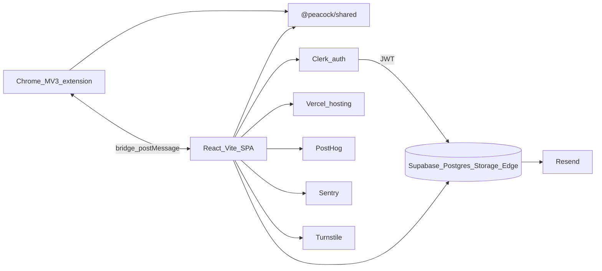
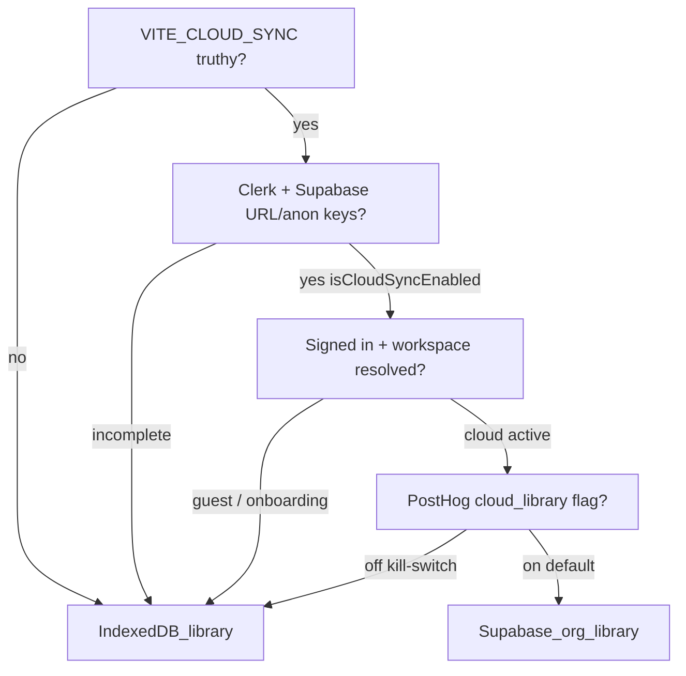
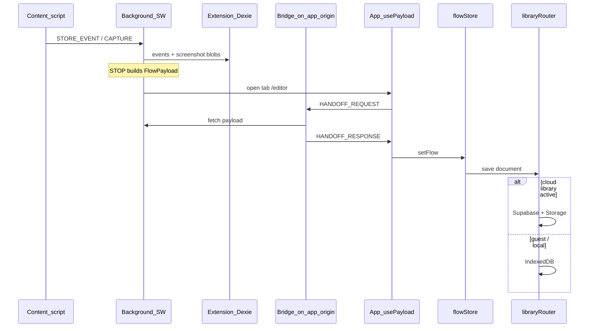

# Peacock Architecture

Canonical **as-implemented** technical architecture for engineers and coding agents.

- **Product vision / specs:** [`document.md`](document.md), [`peacock.md`](peacock.md), [`product-tour.md`](product-tour.md)
- **Agent ops & commands:** [`AGENTS.md`](AGENTS.md)
- **Roadmap:** [`features.md`](features.md) and AGENTS “Features in pipeline”
- **Env wiring:** [`packages/app/.env.example`](packages/app/.env.example)

This document does **not** cover store listing copy, privacy/legal text, marketing copy, or step-by-step Cloudflare ops (see AGENTS Phase 2 checklist).

---

## 1. Purpose and system context

Peacock is a **browser flow recorder + interactive documentation** platform. Users record UI flows with a Chrome extension, edit and play them in a React web app, author product tours, export PDF / Playwright / test cases / flow maps, and (when cloud sync is enabled) sync to org-scoped Supabase with Clerk auth and secure share links.



| Actor | Role |
|-------|------|
| Extension | Captures clicks/inputs/nav + screenshots; hands off `FlowPayload` to the app |
| App | Editor, player, library, tours, PDF, shares, org admin |
| Shared | Event model, selectors, step language, export generators |
| Clerk | Identity when cloud sync is on |
| Supabase | Org library, screenshots Storage, RLS, Edge Functions |
| Vercel | SPA hosting + CSP headers; small `api/` serverless surface |

---

## 2. Monorepo layout

pnpm workspace (`packages/*`). Node `>=20`.

| Path | Package / area | Responsibility |
|------|----------------|----------------|
| [`packages/app`](packages/app) | `@peacock/app` | React 19 + Vite SPA (editor, player, dashboard, PDF, cloud) |
| [`packages/extension`](packages/extension) | `@peacock/extension` | Chrome MV3 recorder (4 Vite builds → `dist`) |
| [`packages/shared`](packages/shared) | `@peacock/shared` | Types, utils, export generators; primary Vitest suite |
| [`supabase/`](supabase) | — | Incremental Postgres/RLS migrations + Edge Functions |
| [`api/`](api) | — | Vercel serverless (super-admin acquisition via PostHog) |
| [`scripts/`](scripts) | — | Sitemap generation |

**Root scripts** ([`package.json`](package.json)):

| Script | Purpose |
|--------|---------|
| `pnpm dev:app` | App dev server → http://localhost:5173 |
| `pnpm build:app` | `tsc --noEmit` + Vite build |
| `pnpm dev:extension` / `build:extension` | Watch / four Vite builds |
| `pnpm test` | Shared + app Vitest |
| `pnpm typecheck` | `tsc --noEmit` across packages |

Install caveats (broken lockfile warning, esbuild scripts): see [`AGENTS.md`](AGENTS.md).

---

## 3. Runtime modes

Cloud is **env-gated**, not always-on. The app is local-first for guests.

### Session modes

Defined in [`packages/app/src/cloud/sessionState.ts`](packages/app/src/cloud/sessionState.ts):

| Mode | When |
|------|------|
| `local` | `VITE_CLOUD_SYNC` not fully enabled (flag off or missing keys) |
| `loading` | Cloud on; Clerk auth not loaded yet |
| `guest` | Cloud on; signed out — IndexedDB library |
| `connecting` | Signed in; workspace/org not yet resolved or library not active |
| `onboarding` | Signed in; no org memberships → workspace chooser |
| `cloud` | Signed in; org selected; cloud library active |

### Gating stack



1. **Env** — [`packages/app/src/cloud/config.ts`](packages/app/src/cloud/config.ts): `isCloudSyncFlagEnabled()` vs `isCloudSyncEnabled()` (flag + `VITE_CLERK_PUBLISHABLE_KEY` + `VITE_SUPABASE_URL` + `VITE_SUPABASE_ANON_KEY`).
2. **Auth / workspace** — [`authContext.ts`](packages/app/src/cloud/authContext.ts): `isCloudLibraryActive()` requires resolved workspace, memberships, and an active org.
3. **Feature flags** — [`analytics/featureFlags.ts`](packages/app/src/analytics/featureFlags.ts): PostHog kill-switches `cloud_library`, `public_share`, `org_invites` (default **on** when cloud flag is on; master hard-off when `VITE_CLOUD_SYNC` is falsy).

### Sync model (important)

There is **no continuous bidirectional sync**. [`libraryRouter.ts`](packages/app/src/storage/libraryRouter.ts) **switches backends**:

- Guest / cloud inactive → IndexedDB only.
- Cloud active → Supabase repositories only (no dual-write).
- Guest → cloud: **one-shot** import ([`importLocalLibrary.ts`](packages/app/src/cloud/importLocalLibrary.ts) / `runLocalLibraryImport.ts`), then clear local library.

---

## 4. App package (`@peacock/app`)

**Entry:** [`main.tsx`](packages/app/src/main.tsx) → providers ([`AppProviders`](packages/app/src/components/auth/AppProviders.tsx)) → [`routes/AppRoutes.tsx`](packages/app/src/routes/AppRoutes.tsx).

### Directory map

| Directory | Purpose |
|-----------|---------|
| `routes/` | Route table + lazy page imports |
| `pages/` | Page components |
| `store/` | Zustand stores (`flowStore`, tour/capture/consent, …) |
| `storage/` | Local IndexedDB (`flowLibraryDb`) + `libraryRouter` |
| `cloud/` | Config, auth context, session, repos, screenshots, share clients |
| `editor/` | Flow editor UI |
| `player/` | Document / guided playback |
| `pdf/` | `@react-pdf/renderer` export |
| `capture-editor/` | Screenshot polish / privacy regions |
| `product-tour-builder/` / `product-tour-learner/` | Tour authoring + playback |
| `route-builder/` / `route-learner/` | Legacy routes (migrated → tours) |
| `workflow-artifacts/` | Flow-map canvas (xyflow) |
| `components/` | Auth, share, library, org-admin, embed, analytics, a11y, … |
| `hooks/` | `usePayload`, `usePersistDocument`, `usePublicShare`, … |
| `services/` | Thin facades over storage/repos |
| `analytics/` | PostHog sinks + feature flags |
| `observability/` | Deferred Sentry |
| `security/` | Turnstile |
| `seo/` | Route meta |
| `types/` | App domain types |

### Route groups

From [`AppRoutes.tsx`](packages/app/src/routes/AppRoutes.tsx):

| Group | Paths |
|-------|-------|
| Marketing | `/`, `/products`, `/solutions`, `/pricing`, `/privacy`, `/terms`, `/install-extension` |
| Auth (cloud flag) | `/sign-in/*`, `/sign-up/*`, `/onboarding/workspace`, `/accept-invite` |
| Library (`LibraryLayout`) | `/dashboard`, `/flow-docs`, `/product-tours`, `/test-cases`, `/playwright-tests`, `/flow-maps`, `/org/admin`, `/super-admin` (+ legacy `/platform/admin`, `/health`, `/api-docs` redirects) |
| Core product | `/editor`, `/docs/:id`, `/docs/:id/edit`, `/capture/:id/edit`, `/compare` |
| Tours | `/tours/new`, `/tours/:id`, `/tours/:id/edit` (legacy `/routes/*` → redirects) |
| Public share | `/s/:token`, `/s/:token/embed`, `/s/:token/edit` |

### State management

- **Zustand + Immer** in `store/` — primary editor state is `flowStore` (outline, screenshots, share settings).
- **Module-level singletons** for cloud auth/session ([`authContext.ts`](packages/app/src/cloud/authContext.ts), [`sessionState.ts`](packages/app/src/cloud/sessionState.ts)) — not Zustand.

---

## 5. Extension package (`@peacock/extension`)

Chrome MV3. Build-only (no dedicated long-lived “dev server”); load `packages/extension/dist` unpacked. Four Vite builds ([`package.json`](packages/extension/package.json)):

| Build | Role |
|-------|------|
| Background (main) | Service worker: recording state, screenshots, handoff, session |
| Content | Page listeners (click/input/nav), privacy, recording UI |
| Bridge | Injected on app origin; `window.postMessage` ↔ extension |
| Capture tool | Full-page / visible / selection screenshots |

### Local storage (Dexie)

[`packages/extension/src/storage/db.ts`](packages/extension/src/storage/db.ts) — DB name `PeacockDB`:

| Store | Contents |
|-------|----------|
| `screenshots` | Blob + tabId + timestamp |
| `events` | `FlowEvent` records |
| `captures` | Standalone capture results (mode + blob) |

### Messaging

- Typed `chrome.runtime` messaging under `messaging/`.
- **Primary handoff:** bridge content script + `window.postMessage` (`HANDOFF_REQUEST` / `HANDOFF_RESPONSE` from `@peacock/shared`).
- **Fallback:** `chrome.runtime.sendMessage` + `externally_connectable` (origins patched at build via `VITE_APP_URL` / `patchManifest.ts`).
- Capture-only: `CAPTURE_HANDOFF_*` → `/capture/:captureId/edit`.

---

## 6. Shared package (`@peacock/shared`)

Single barrel: [`packages/shared/src/index.ts`](packages/shared/src/index.ts).

**Ownership conventions** (also in `.cursorrules`):

| Concern | Location |
|---------|----------|
| Event types | `types/events.ts` |
| Element snapshots | `utils/extractElementSnapshot.ts` |
| Step descriptions | `utils/stepDescription.ts` (+ labels) |
| Coordinates | Normalized floats `0–1` (`utils/coordinates.ts`) |
| Privacy / masking | `utils/classifyField.ts`, `utils/masking.ts`, `constants/privacy.ts` |
| Image prep for cloud | `utils/compressImage.ts` |
| Handoff constants | `constants/handoff.ts`, `constants/captureHandoff.ts` |

**Exports:** Playwright specs, test-case markdown, flow-map Mermaid/markdown, workflow graph builders under `export/`.

Primary automated tests live here (app has additional tests; type gate is `pnpm typecheck`).

---

## 7. End-to-end data flows

### Recording → handoff → library



### Local persistence

- Library: **`idb`** (not Dexie) — [`flowLibraryDb.ts`](packages/app/src/storage/flowLibraryDb.ts)
- DB name: `peacock-flow-library`, version **5**
- Stores: `documents`, `routes` (legacy), `personas`, `productTours`
- Screenshots for saved flows: **inline** in `SavedFlowDocument.screenshotUrls` (data URLs), not a separate object store
- In-DB migrations: default persona seed; routes → product tours; persona `goal` → tour `tourGoal`

### Cloud persistence

- Org-scoped Postgres rows (`flow_documents`, `product_tours`, `personas`, …)
- Screenshots: compress → SHA-256 dedupe → Storage bucket `screenshots` → `screenshot_assets` → signed URLs on read ([`screenshotStorage.ts`](packages/app/src/cloud/screenshotStorage.ts))
- MIME JPEG/PNG; size limit enforced in Storage policies / migrations (~1 MB)

### Player, PDF, artifacts

- Read via `libraryRouter` (or public share client when a share token is set)
- PDF: `packages/app/src/pdf/` (`@react-pdf/renderer`)
- Generated artifacts: test cases, Playwright, flow maps — cloud table `workflow_artifacts` via [`workflowArtifactRepository.ts`](packages/app/src/cloud/repositories/workflowArtifactRepository.ts)

### Public share

1. Create/update `share_links` ([`shareLinkRepository.ts`](packages/app/src/cloud/repositories/shareLinkRepository.ts)) with capabilities `share` / `embed`
2. Viewer opens `/s/:token` (+ `/embed`, `/edit`)
3. Turnstile challenge → Edge Function **`resolve-share`**
4. Security-definer RPCs (`resolve_share_link`, `get_shared_flow_document`, …) — **no anon SELECT** of share tokens
5. Options: expiry, revoke, `requires_auth` (signed-in org member), draft docs blocked from public resolve

---

## 8. Cloud data model

Committed migrations under [`supabase/migrations/`](supabase/migrations/) are **incremental** (RLS, quotas, shares, invites, …). Baseline `CREATE TABLE` for core entities is **not** in this repo’s migration history — treat live Supabase schema + app repositories as the source of truth for column shapes.

### Tables (roles)

| Table | Role |
|-------|------|
| `organizations` | Workspace; `plan`, `workspace_type`, `doc_limit`, `storage_bytes` / `storage_bytes_limit` |
| `organization_members` | Clerk user ↔ org; role; capabilities jsonb; status |
| `organization_invitations` | Invite tokens, expiry, accept/revoke |
| `organization_groups` / `organization_group_members` | Capability groups |
| `user_profiles` | Display names keyed by email / Clerk id |
| `flow_documents` | Flow JSON, steps, share_settings, status (`draft`\|`live`) |
| `screenshot_assets` | Metadata + `content_hash`; files in Storage `screenshots` |
| `product_tours` | Tours + features jsonb; optional `migrated_from_route` |
| `personas` | Buyer personas |
| `share_links` | Token, access_mode, channel, expires/revoked, `requires_auth` |
| `workflow_artifacts` | `test_cases` \| `playwright` \| `flow_map` per document |
| `analytics_events` | Org / share analytics (via RPCs) |
| `email_send_log` | Invite email audit |
| `edge_rate_limits` | Edge Function rate limiting |

### Capabilities and RLS

Capability keys: `read | create | edit | delete | share | export | embed`.

Helpers (see `20260724100000_capability_rls.sql`): `user_organization_ids()`, `is_org_admin()`, `member_has_capability()`, `effective_member_capabilities()`.

Library tables: SELECT for org members; mutations gated by capability. Share access goes through RPCs + Edge gate, not open table policies for anon.

### Plan limits

| Layer | Mechanism |
|-------|-----------|
| Server | `organizations.doc_limit` (default 10), `storage_bytes_limit` (default 100 MB); triggers on doc upsert / screenshot insert |
| Client UX | [`planLimits.ts`](packages/app/src/cloud/planLimits.ts): `VITE_GUEST_VISIBLE_DOC_LIMIT` (default 3), `VITE_FREE_ACCOUNT_DOC_LIMIT`, `VITE_FREE_ACCOUNT_STORAGE_BYTES_LIMIT` |
| Embed chrome | Watermark hidden for plans `pro` \| `team` |

### Repositories

Under [`packages/app/src/cloud/repositories/`](packages/app/src/cloud/repositories/):

| File | Surface |
|------|---------|
| `flowDocumentRepository.ts` | `flow_documents` + screenshot sync |
| `productTourRepository.ts` | `product_tours` |
| `personaRepository.ts` | `personas` |
| `organizationRepository.ts` | Memberships, invites, groups (mostly RPCs) |
| `shareLinkRepository.ts` | `share_links` |
| `profileRepository.ts` | `user_profiles` |
| `workflowArtifactRepository.ts` | `workflow_artifacts` |
| `analyticsRepository.ts` | `record_*` / analytics summary RPCs |
| `platformAdminRepository.ts` | Calls `platform-admin` Edge Function |

**Convention:** UI and hooks should prefer [`libraryRouter`](packages/app/src/storage/libraryRouter.ts) for documents/tours/personas so local vs cloud switching stays in one place. Call repositories directly for org admin, shares, analytics, and platform admin.

Cloud library is used only when:

```ts
isCloudSyncEnabled() && isCloudLibraryActive() && isCloudLibraryFeatureEnabled()
```

Public share token (when set) overrides get paths to [`publicShareClient.ts`](packages/app/src/cloud/publicShareClient.ts).

---

## 9. Auth, orgs, and onboarding

### Clerk → Supabase

```
AppProviders
  → DeferredCloudAuth (skip Clerk on marketing routes)
    → ClerkCloudAuthTree (ClerkProvider)
      → CloudSyncProviderInner
```

- Clerk JWT is passed as Supabase `accessToken` (third-party auth). See `.env.example` for JWT template notes.
- Boot ([`CloudSyncProviderInner`](packages/app/src/components/auth/CloudSyncProviderInner.tsx)): get token → upsert `user_profiles` → list memberships → pick active org (`localStorage` key `peacock.activeOrganizationId`) → mark workspace resolved → cloud library active.

### Workspaces

- `workspace_type`: `personal` | `team`
- Roles: `admin` | `member`
- Invites: Edge Function **`send-org-invite`** (Resend + Turnstile + admin/email guards)
- Org admin UI: `/org/admin`

### Super admin

- UI: `/super-admin` (legacy `/platform/admin`, `/health`, `/api-docs` redirect into tabs)
- Auth: Edge Function secret `SUPER_ADMIN_EMAILS` (never a `VITE_*` var)
- Edge Function: **`platform-admin`**
- Ops detail: [`AGENTS.md`](AGENTS.md) “Platform super admin”
- Acquisition metrics: [`api/super-admin/`](api/super-admin) (server env PostHog key)

---

## 10. Feature surfaces

Architecture-focused map (where code lives + which stores):

| Surface | Code | Persistence |
|---------|------|-------------|
| Flow editor | `editor/`, `pages/Editor.tsx` | `flowStore` → `libraryRouter` documents |
| Document player | `player/`, `/docs/:id` | Same documents |
| Compare | `pages/CompareDocs` | Two document loads (index-based today) |
| Capture editor | `capture-editor/`, `/capture/:id/edit` | Extension Dexie captures → handoff |
| Product tour builder / learner | `product-tour-*`, `/tours/*` | `productTours` + linked document IDs |
| Flow maps | `workflow-artifacts/` | Derived graph; cloud `workflow_artifacts` |
| Test cases / Playwright libs | library pages + shared exporters | Derived + optional cloud artifact rows |
| PDF export | `pdf/` | Client-side from current document |
| Embed / share | `components` share + `PublicSharePage` | `share_links` + resolve-share |
| Org admin / analytics | `components` + org pages | Org repos + `analytics_events` |

---

## 11. Cross-cutting concerns

| Concern | Implementation |
|---------|----------------|
| Security headers / CSP | [`vercel.json`](vercel.json) — allows Clerk, Supabase, PostHog, Sentry, Turnstile, Freshchat |
| Bot / abuse | Turnstile on share resolve + invites; `edge_rate_limits`; Storage MIME/size |
| Authorization | RLS + capability checks in repos |
| Secrets | Never put allowlists or private keys in `VITE_*` |
| Privacy | Shared field classification/masking; extension skips passwords / sensitive URLs; capture privacy regions |
| Analytics | PostHog (consent-gated) + Supabase `record_org_event` / `record_share_event` |
| Errors | Deferred Sentry; error boundaries; soft-fail helpers on handoff |
| Consent | Cookie consent store + banners |
| Conventions | TypeScript strict; Tailwind only; Zustand; coords 0–1; never log passwords/tokens |

---

## 12. Build and deploy

| Surface | How |
|---------|-----|
| App | Vite → `packages/app/dist`; Vercel SPA rewrite + security headers |
| Extension | Four Vite builds → `packages/extension/dist`; store packaging: [`extension-store-deployment.md`](extension-store-deployment.md), [`packages/extension/web-store.md`](packages/extension/web-store.md) |
| Supabase | Apply migrations; deploy Edge Functions with `verify_jwt=false` (Clerk JWTs): `resolve-share`, `send-org-invite`, `platform-admin` |
| API | `api/super-admin/*` on Vercel (server secrets) |
| Sitemap | `scripts/generate-sitemap.mjs` |

**Phase 2 Cloudflare** (ops only, after cloud default-on): checklist in [`AGENTS.md`](AGENTS.md) — do not duplicate here.

App Vite notes: path alias `@`; manual chunks for heavy vendors (sentry, clerk, posthog, pdf, xyflow, charts, swagger).

---

## 13. Doc map and known gaps

### Related docs

| File | Owns |
|------|------|
| [`architecture.md`](architecture.md) | This document — as-implemented system architecture |
| [`AGENTS.md`](AGENTS.md) | Agent commands, cloud gating summary, Cloudflare ops, super-admin secrets |
| [`document.md`](document.md) | Product bible (may drift on routes/features) |
| [`peacock.md`](peacock.md) | Original detailed build plan |
| [`features.md`](features.md) | Enhancement plan + implementation status |
| [`product-tour.md`](product-tour.md) | Tour product positioning |
| [`release-qa-checklist.md`](release-qa-checklist.md) | QA |
| [`extension-store-deployment.md`](extension-store-deployment.md) | Extension store deploy |
| [`packages/app/.env.example`](packages/app/.env.example) | Env + Clerk/Supabase wiring |
| Privacy / store / support `*.md` | Legal and listing copy — not architecture |

### Known gaps / non-obvious points

1. **Dexie vs `idb`:** `.cursorrules` / older docs mention Dexie for screenshots; the **app library uses `idb`**. Only the **extension** uses Dexie.
2. **No baseline schema in git:** migrations assume core tables already exist; greenfield `db push` from migrations alone is incomplete.
3. **Dual handoff paths:** bridge `postMessage` (primary) vs `externally_connectable` + `chrome.runtime` fallback; production origins patched at extension build time.
4. **Three gates for cloud library:** env keys, auth/workspace context, PostHog `cloud_library` flag.
5. **Legacy routes:** IndexedDB `routes` store + `route-builder` still present; product URLs redirect to tours with migration helpers.
6. **Screenshot representation differs by mode:** extension Blobs → handoff data URLs → local inline URLs vs cloud Storage + signed URLs.
7. **Plan limits split:** client Vite env for UX prompts vs DB columns/triggers for enforcement; plan string mainly drives embed watermark today (billing not fully productized).
8. **`document.md` drift:** prefer this file + live routes for “what ships now.”
9. **Services vs repositories:** prefer `libraryRouter` for library CRUD; repos for cloud-only admin/share/analytics.

### Roadmap (not shipped as default)

See AGENTS “Features in pipeline”: default-on cloud, billing, deeper analytics, AI rewrite, multi-browser extension, etc. Do not treat those as current architecture.
