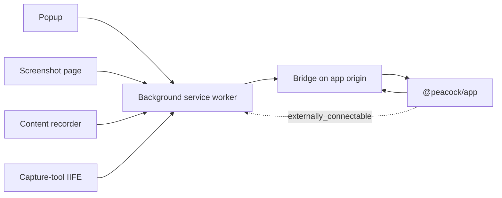
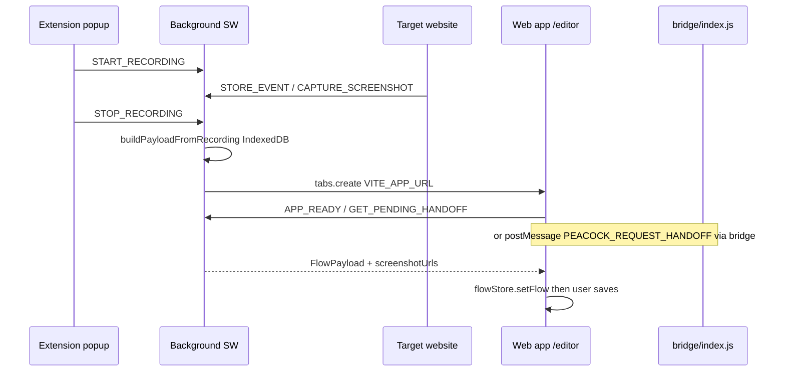

# Peacock Chrome extension — developer guide

Developer reference for `@peacock/extension`: architecture, build, messaging, app handoff, and local workflows.

For Chrome/Edge **store submission** and packaging, see [extension-store-deployment.md](extension-store-deployment.md), [packages/extension/web-store.md](packages/extension/web-store.md), and [packages/extension/edge-addons.md](packages/extension/edge-addons.md).

---

## Table of contents

1. [Purpose and mental model](#1-purpose-and-mental-model)
2. [Architecture overview](#2-architecture-overview)
3. [Package layout](#3-package-layout)
4. [Manifest and permissions (MV3)](#4-manifest-and-permissions-mv3)
5. [Build system](#5-build-system)
6. [Feature deep-dives](#6-feature-deep-dives)
7. [Messaging protocols](#7-messaging-protocols)
8. [App integration](#8-app-integration)
9. [Shared package contract](#9-shared-package-contract)
10. [Local development workflow](#10-local-development-workflow)
11. [Caveats and gotchas](#11-caveats-and-gotchas)
12. [Where to change what](#12-where-to-change-what)
13. [Related docs](#13-related-docs)

---

## 1. Purpose and mental model

The extension is a **local-first Chrome MV3 recorder + screenshot tool**. Package name: `@peacock/extension` (version tracks `packages/extension/package.json`).

**Hard boundary:** recording happens **only** in the extension. The web app (`@peacock/app`) never starts recording and never streams live events during a session.

| Phase | Where it runs |
|-------|----------------|
| Record clicks / inputs / navigation / screenshots | Extension (content + background + Dexie) |
| Stop recording or “Edit” a screenshot | Extension opens an app URL |
| Load payload into the editor | App **pulls** pending data via bridge and/or `chrome.runtime` |
| Auth, cloud sync, sharing, tours | App only (Clerk / Supabase) — **not** in the extension |

After handoff, screenshots and events live in the app’s own stores. The extension does not upload to the cloud.

---

## 2. Architecture overview



| Piece | Key paths | Role |
|-------|-----------|------|
| Background SW | [`packages/extension/src/background/`](packages/extension/src/background/) | Recording lifecycle, Dexie, `captureVisibleTab`, handoff delivery |
| Content recorder | [`packages/extension/src/content/`](packages/extension/src/content/) | DOM listeners on arbitrary sites; recording FAB UI |
| Bridge | [`packages/extension/src/bridge/index.ts`](packages/extension/src/bridge/index.ts) | App-origin page ↔ background via `postMessage` |
| Capture-tool | [`packages/extension/src/capture-tool/`](packages/extension/src/capture-tool/) | Selection / full-page helpers; injected on demand (not a static content script) |
| Popup | [`packages/extension/popup/`](packages/extension/popup/) | Start / pause / resume / stop + screenshot tool modes |
| Screenshot page | [`packages/extension/screenshot/`](packages/extension/screenshot/) | Preview, download, clipboard, open capture editor |



---

## 3. Package layout

```text
packages/extension/
  manifest.json              # MV3 source (patched at build)
  package.json               # build = four sequential Vite builds
  vite.config.ts             # main: background, popup, screenshot; empties dist/
  vite.content.config.ts     # content/index.js (IIFE)
  vite.bridge.config.ts      # bridge/index.js (IIFE)
  vite.capture-tool.config.ts
  .env.local / .env.production   # VITE_APP_URL
  logo.png
  popup/                     # action popup UI
  screenshot/                # capture result page
  src/
    background/              # service worker + capture orchestration
    content/                 # recorder (+ inputCapture/, privacy, UI)
    bridge/                  # app-origin bridge
    capture-tool/            # selection / full-page inject
    messaging/
    storage/db.ts            # Dexie PeacockDB
    build/patchManifest.ts
    utils/                   # appUrl, payload, blob helpers
  dist/                      # load this folder as unpacked extension
  web-store.md               # Chrome Web Store listing checklist
```

There is **no** extension-only README besides this root guide and the store docs above.

---

## 4. Manifest and permissions (MV3)

**Source:** [`packages/extension/manifest.json`](packages/extension/manifest.json)  
**Built:** `packages/extension/dist/manifest.json` (via [`src/build/patchManifest.ts`](packages/extension/src/build/patchManifest.ts))

| Field | Value |
|-------|--------|
| `manifest_version` | `3` |
| `name` | Peacock Studio |
| Permissions | `activeTab`, `clipboardWrite`, `scripting`, `storage`, `tabs` |
| Host permissions | `<all_urls>` |
| Background | `background/index.js` (`type: "module"`) |
| Action popup | `popup/index.html` (“Peacock Recorder”) |

### Content scripts

| Script | Matches | Notes |
|--------|---------|--------|
| Recorder `content/index.js` | `<all_urls>` | `all_frames: true`, `document_idle`; **excludes** app origins |
| Bridge `bridge/index.js` | App origins only | `document_start`; sets `data-peacock-extension="installed"` |

### `externally_connectable`

Allows the web app to call `chrome.runtime.sendMessage(extensionId, …)` for handoff / ping. Source defaults to localhost; production origin is added from `VITE_APP_URL` at build time.

### Why `VITE_APP_URL` must match the running app

`patchManifestForAppUrl` uses the app origin to:

1. Add the origin to bridge `matches` and `externally_connectable`
2. Add it to the recorder’s `exclude_matches` (so the recorder does not run on the Studio app)
3. Drive editor / dashboard / capture-editor URLs opened by the background worker ([`src/utils/appUrl.ts`](packages/extension/src/utils/appUrl.ts))

Wrong env → broken handoff, missing bridge, or recorder fighting the app UI.

---

## 5. Build system

### Four sequential Vite builds

From [`packages/extension/package.json`](packages/extension/package.json):

```text
vite build
&& vite build -c vite.content.config.ts
&& vite build -c vite.bridge.config.ts
&& vite build -c vite.capture-tool.config.ts
```

| Build | Config | Output | Notes |
|-------|--------|--------|-------|
| Main | `vite.config.ts` | `dist/` | Empties `dist/`; background ESM, popup + screenshot HTML; copies patched manifest + logo |
| Content | `vite.content.config.ts` | `content/index.js` | IIFE; `emptyOutDir: false` |
| Bridge | `vite.bridge.config.ts` | `bridge/index.js` | IIFE |
| Capture-tool | `vite.capture-tool.config.ts` | `capture-tool/index.js` | IIFE; injected via `scripting.executeScript`, not a static content script |

Shared alias: `@peacock/shared` → `../shared/src`.

### Commands

| Command | Effect |
|---------|--------|
| `pnpm build:extension` | Full production four-step build |
| `pnpm dev:extension` | `pnpm build --watch` — rebuilds `dist/` on change; **not** Vite HMR |
| `pnpm --filter @peacock/extension typecheck` | `tsc --noEmit` |

### Load unpacked

1. Build or watch-build the extension
2. Chrome → `chrome://extensions` → Developer mode → **Load unpacked**
3. Select **`packages/extension/dist`** (the folder contents become the extension, not the parent `extension/` package)

After code changes: wait for watch rebuild, then click **Reload** on the extension card, and refresh target tabs (content scripts / bridge).

### Environment

| Var | Package | Purpose |
|-----|---------|---------|
| `VITE_APP_URL` | extension | Editor URL + origin for manifest patch. Local: `http://localhost:5173/editor`. Production: `https://peacock-studio.vercel.app/editor` |
| `VITE_EXTENSION_ID` | app (optional) | Unpacked or alternate store ID for direct `chrome.runtime` messaging. If blank, app uses published ID + bridge fallback |

Helpers: `getAppOrigin()`, `getEditorPageUrl()`, `getDashboardPageUrl()`, `getCaptureEditorPageUrl()` in [`src/utils/appUrl.ts`](packages/extension/src/utils/appUrl.ts).

---

## 6. Feature deep-dives

### A. Flow recording

1. User opens the popup → countdown ([`popup/startRecordingCountdown.ts`](packages/extension/popup/startRecordingCountdown.ts)) → `START_RECORDING`
2. Background sets recording status and ensures the content script is injected ([`injectContentScript.ts`](packages/extension/src/background/injectContentScript.ts))
3. Content script records clicks, inputs, navigation / page-views, submits ([`src/content/`](packages/extension/src/content/))
4. Events and screenshot Blobs go to Dexie `PeacockDB` ([`src/storage/db.ts`](packages/extension/src/storage/db.ts))
5. Invisible FAB host `#peacock-recording-ui` for pause/status ([`recordingUi.ts`](packages/extension/src/content/recordingUi.ts)) — uses **inline styles** on purpose (content-script isolation; not Tailwind)
6. Privacy:
   - Sensitive fields skipped via `isSensitiveField` / `isNonRecordableInput` from shared
   - Sensitive URL path pause: `/login`, `/payment`, `/billing` ([`privacy.ts`](packages/extension/src/content/privacy.ts))
   - Clicks on Peacock UI ignored
   - Input coalescing / IME handling under `content/inputCapture/`
7. Stop → flush pending inputs → build `FlowPayload` ([`src/utils/payload.ts`](packages/extension/src/utils/payload.ts)) → mark handoff pending → open `VITE_APP_URL` → app pulls payload

Screenshots during recording use `chrome.tabs.captureVisibleTab`, compressed, stored as Blobs. At handoff they become data URLs for the app.

### B. Screenshot tool (non-recording)

Popup sends `START_SCREENSHOT_TOOL` with mode: `visible` | `selection` | `full-page`.

| Mode | Behavior |
|------|----------|
| Visible | Single `captureVisibleTab` |
| Selection | Inject capture-tool → user crop → `cropVisibleCapture` |
| Full-page | Scroll stops, stitch tiles, suppress fixed/sticky overlays |

Result UI: `chrome-extension://…/screenshot/index.html` — preview, download, clipboard (`clipboardWrite`), **Edit** opens app `/capture/:captureId/edit`.

Capture-tool tab messages (not part of `ExtensionMessage`): `PEACOCK_GET_CAPTURE_METRICS`, `PEACOCK_SCROLL_CAPTURE_PAGE`, `PEACOCK_DISCOVER_VIEWPORT_OVERLAYS`, `PEACOCK_SET_VIEWPORT_OVERLAYS_SUPPRESSED`, `PEACOCK_RESTORE_CAPTURE_PAGE`, `PEACOCK_START_SELECTION_CAPTURE`.

---

## 7. Messaging protocols

Three channels. Typed contracts live in `@peacock/shared`.

### 1. Internal — `chrome.runtime.sendMessage` (`ExtensionMessage`)

Defined in [`packages/shared/src/types/messages.ts`](packages/shared/src/types/messages.ts). Handled primarily in [`src/background/index.ts`](packages/extension/src/background/index.ts). Helper: [`src/messaging/sendExtensionMessage.ts`](packages/extension/src/messaging/sendExtensionMessage.ts).

| Type | Direction | Purpose |
|------|-----------|---------|
| `START_RECORDING` / `PAUSE_RECORDING` / `RESUME_RECORDING` / `STOP_RECORDING` | popup / content → BG | Lifecycle |
| `GET_RECORDING_STATE` / `RECORDING_STATE` | bi-dir | Sync popup + page UI |
| `STORE_EVENT` | content → BG | Persist event |
| `CAPTURE_SCREENSHOT` | content → BG | Visible tab → IndexedDB |
| `CAPTURE_PAGE_SNAPSHOT` / `CAPTURE_FINAL_PAGE` / `CAPTURE_NAVIGATION_PAGE_VIEW` | BG ↔ content | Snapshots around nav |
| `FLUSH_PENDING_INPUTS` | BG → content | Coalesce before stop |
| `CAPTURE_ENVIRONMENT` | BG → content | Capture env metadata |
| `START_SCREENSHOT_TOOL` | popup → BG | Quick capture modes |
| `CONTENT_SCRIPT_READY` | content → BG | SPA load / page-view |
| `GET_PENDING_HANDOFF` / `APP_READY` | app / bridge → BG | Flow handoff |
| `GET_CAPTURE_RESULT` | app / bridge → BG | Screenshot handoff |
| `PING` | anywhere → BG / content | Reachability |
| `RECORDING_STARTED` / `INJECT_PAYLOAD` | legacy / special | See `messages.ts` |

### 2. Bridge — `window.postMessage` (same origin, app pages only)

Constants in shared:

| Request | Response | File |
|---------|----------|------|
| `PEACOCK_REQUEST_HANDOFF` | `PEACOCK_HANDOFF_RESPONSE` | [`handoff.ts`](packages/shared/src/constants/handoff.ts) |
| `PEACOCK_REQUEST_CAPTURE_HANDOFF` | `PEACOCK_CAPTURE_HANDOFF_RESPONSE` | [`captureHandoff.ts`](packages/shared/src/constants/captureHandoff.ts) |
| `PEACOCK_EXTENSION_PING` | `PEACOCK_EXTENSION_PONG` | [`extensionPing.ts`](packages/shared/src/constants/extensionPing.ts) |

Bridge behavior ([`src/bridge/index.ts`](packages/extension/src/bridge/index.ts)):

- Sets DOM marker `data-peacock-extension="installed"`
- Relays handoff / capture / ping to the background
- Auto-retries flow handoff on timers `[0, 300, 800, 1500, 3000, 5000]` ms (editor may load before the service worker is ready)

### 3. External — `chrome.runtime.onMessageExternal`

Same subset the app uses when it knows the extension ID: `PING`, `APP_READY`, `GET_PENDING_HANDOFF`, `GET_CAPTURE_RESULT`. Requires the app origin in `externally_connectable`.

### Dual-path design (app)

Prefer `chrome.runtime.sendMessage(extensionId, …)` when an ID is known (`VITE_EXTENSION_ID` or published ID). Fall back to the content-script bridge so one app deploy works without hardcoding Chrome vs Edge IDs.

Published Chrome ID: `abjglkkkjaoabboginagilnejoacnnnm` ([`packages/app/src/constants/extension.ts`](packages/app/src/constants/extension.ts)).

---

## 8. App integration

### Key app files

| File | Role |
|------|------|
| [`hooks/usePayload.ts`](packages/app/src/hooks/usePayload.ts) | Flow handoff on `/editor` |
| [`hooks/useCaptureSource.ts`](packages/app/src/hooks/useCaptureSource.ts) | Image handoff on `/capture/:captureId/edit` |
| [`utils/probeExtensionInstalled.ts`](packages/app/src/utils/probeExtensionInstalled.ts) | DOM marker → ping → runtime |
| [`hooks/useExtensionInstalled.ts`](packages/app/src/hooks/useExtensionInstalled.ts) | React wrapper for install status |
| [`utils/getExtensionId.ts`](packages/app/src/utils/getExtensionId.ts) | Env or published ID |
| [`utils/extensionGate.ts`](packages/app/src/utils/extensionGate.ts) | `/install-extension?next=` |
| [`pages/ExtensionInstallPage.tsx`](packages/app/src/pages/ExtensionInstallPage.tsx) | Install UX |
| [`components/extension/*`](packages/app/src/components/extension/) | Banner, CWS link, desktop-required |

### After handoff

1. Flow: `usePayload` → `flowStore.setFlow(payload, screenshotUrls)` → user saves → library / `/docs/:id/edit`
2. Capture: `useCaptureSource` → capture editor
3. **Product tours are not created by the extension.** Tours are composed in-app and reference saved document IDs.

Bridge and capture-tool bundles are **extension builds**, not app routes. App-served routes the extension opens: `/editor`, `/capture/:captureId/edit` (plus legacy redirect from `/editor/capture/:captureId/edit`).

---

## 9. Shared package contract

Treat changes in `@peacock/shared` that the extension imports as **extension API changes**. Heavily used surface:

| Area | Symbols / modules |
|------|-------------------|
| Messages | `ExtensionMessage`, `RecordingStateSnapshot`, `RecordingStatus` |
| Events / payload | `FlowEvent`, `FlowPayload`, click / input / page-view / navigation types, `createFlowStep`, `createId` |
| Handoff constants | `HANDOFF_*`, `CAPTURE_HANDOFF_*`, `EXTENSION_PING_*` |
| Capture types | `CaptureResultHandoff`, `ScreenshotToolMode`, `FlowCaptureEnvironment` |
| DOM / privacy | `extractElementSnapshot`, `resolveClickTarget`, `isSensitiveField`, `isNonRecordableInput`, `normalizePosition`, `getViewport` |
| Input UX | `createImeCompositionState`, `shouldCoalesceInputEvents`, `mergeCoalescedInputEvent`, `getEventTargetElement` |
| Images | `compressImageToMaxBytes`, `blobToDataUrl` |
| Env | `collectCaptureEnvironmentFromWindow` |

Repo automated tests cover `@peacock/shared` only (`pnpm test`). Extension behavior is validated manually ([release-qa-checklist.md](release-qa-checklist.md)).

---

## 10. Local development workflow

1. `pnpm install` at repo root
2. Ensure `packages/extension/.env.local` has `VITE_APP_URL=http://localhost:5173/editor`
3. Terminal A: `pnpm dev:app` → http://localhost:5173
4. Terminal B: `pnpm dev:extension` (watch build into `dist/`)
5. Load unpacked → `packages/extension/dist`
6. Optional: copy the unpacked extension ID from `chrome://extensions` into the app’s `VITE_EXTENSION_ID`, then restart the app, to exercise direct `runtime` messaging
7. Confirm install probe: open the app, check `document.documentElement` for `data-peacock-extension="installed"`, or use dashboard / install UI
8. Record on a normal https site (not `chrome://`), stop, confirm `/editor` receives the flow
9. Typecheck: `pnpm --filter @peacock/extension typecheck`
10. Manual QA: [release-qa-checklist.md](release-qa-checklist.md)

**Hot reload:** there is none. Rebuild → reload extension → refresh tabs.

---

## 11. Caveats and gotchas

1. **Build-only package** — no extension Vite dev server ([AGENTS.md](AGENTS.md)).
2. **Build order matters** — main clears `dist/`; content / bridge / capture-tool must run after with `emptyOutDir: false`.
3. **`VITE_APP_URL` must match** the app you open, or bridge / `externally_connectable` / exclude list break.
4. **Restricted pages** — cannot inject into `chrome://`, `chrome-extension://`, `edge://`, `about:`, `devtools://`, `view-source:` (`canInjectIntoUrl`).
5. **Screenshot quota** — `captureVisibleTab` is rate-limited (~2/sec) in [`screenshot.ts`](packages/extension/src/background/screenshot.ts).
6. **Handoff is one-shot** — successful payload build clears recording data; in-memory cache supports short retries while the editor loads.
7. **Data URLs at handoff** — Blobs stay in IndexedDB during record; conversion for the app can be large for long sessions.
8. **Sensitive URL pause** — path heuristics only (`/login`, `/payment`, `/billing`), not full PII detection.
9. **Recording UI inline styles** — intentional for content-script isolation (exception to app Tailwind rule).
10. **Published vs unpacked ID** — store ID differs from local; use `VITE_EXTENSION_ID` or rely on the bridge.
11. **`clipboardWrite`** — used on the screenshot result page, not during recording.
12. **Capture-tool is on-demand** — only injected for selection / full-page tools.
13. **No auth in the extension** — intentional local-first boundary.

---

## 12. Where to change what

| I want to… | Start here |
|------------|------------|
| Add a recorded event type | Shared `events.ts` + content listeners + `payload.ts` + app editor / player |
| Change editor / dashboard open URL | Extension `VITE_APP_URL` + [`appUrl.ts`](packages/extension/src/utils/appUrl.ts) |
| Change install detection | Bridge DOM marker + [`probeExtensionInstalled.ts`](packages/app/src/utils/probeExtensionInstalled.ts) |
| Change handoff protocol | Shared handoff / captureHandoff constants + bridge + `usePayload` / `useCaptureSource` |
| Change recording privacy rules | [`privacy.ts`](packages/extension/src/content/privacy.ts) + shared `isSensitiveField` |
| Change screenshot modes / stitching | [`background/index.ts`](packages/extension/src/background/index.ts) + [`capture-tool/`](packages/extension/src/capture-tool/) |
| Change popup UX | [`packages/extension/popup/`](packages/extension/popup/) |
| Ship to Chrome / Edge stores | [extension-store-deployment.md](extension-store-deployment.md), [web-store.md](packages/extension/web-store.md), [edge-addons.md](packages/extension/edge-addons.md) |

---

## 13. Related docs

| Doc | Purpose |
|-----|---------|
| [AGENTS.md](AGENTS.md) | Monorepo commands and package roles |
| [extension-store-deployment.md](extension-store-deployment.md) | Chrome + Edge packaging and deploy (Firefox Phase 3 notes) |
| [packages/extension/web-store.md](packages/extension/web-store.md) | Chrome Web Store listing copy / privacy answers |
| [packages/extension/edge-addons.md](packages/extension/edge-addons.md) | Edge Add-ons listing / Partner Center |
| [release-qa-checklist.md](release-qa-checklist.md) | Manual release QA |
| [document.md](document.md) | Product bible (includes extension product overview) |
| [privacy-policy.md](privacy-policy.md) | Privacy policy copy |
| [store-listing-copy.md](store-listing-copy.md) | Marketing / store listing copy |
